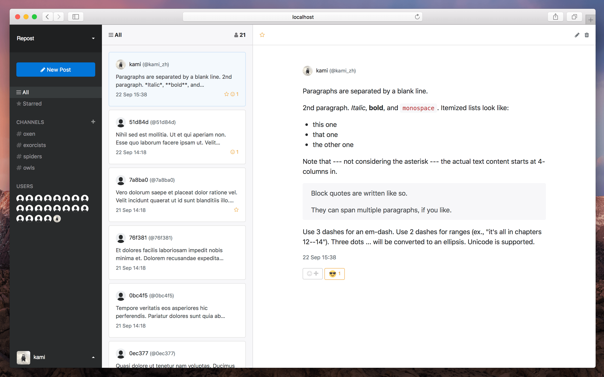
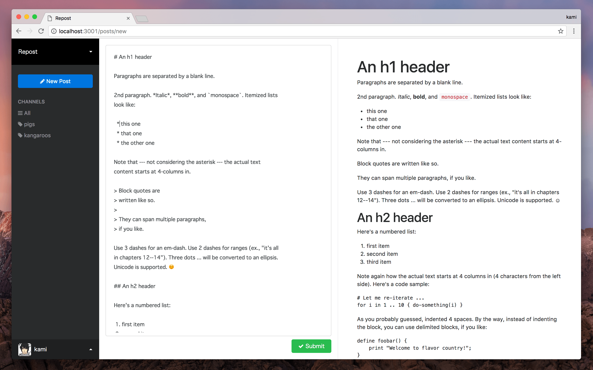

# Repost

[](https://gitter.im/repostapp/Lobby?utm_source=badge&utm_medium=badge&utm_campaign=pr-badge&utm_content=badge)

[](https://circleci.com/gh/kami-zh/repost)

Repost is an open source software to communicate with your team members through posting daily reports.
This project focuses on a good user interface using Redux and React.
Ruby on Rails is used for the backend server.

**NOTICE**
Repost is still under development.
So it may occur breaking changes, and **it's too insecure to use** this.

## Screenshot





## Build with

Repost is build with following libraries.
This project is still pre-alpha, so it adopts latest version of each.

- Ruby
- Ruby on Rails
- Redux
- React
- PostgreSQL
- draft.js

## Development

To develop Repost, you should run servers of Ruby on Rails and Webpack.
`db:populate` fills your database with example data.

```
$ git clone git@github.com:kami-zh/repost.git
$ cd repost
$ bundle install
$ bin/rails db:create db:migrate db:seed_fu db:populate
$ bin/rails s
$ bin/webpack-dev-server
```

## Contributing

Bug reports and pull requests are welcome on GitHub at https://github.com/kami-zh/repost.

## License

The gem is available as open source under the terms of the [MIT License](http://opensource.org/licenses/MIT).
